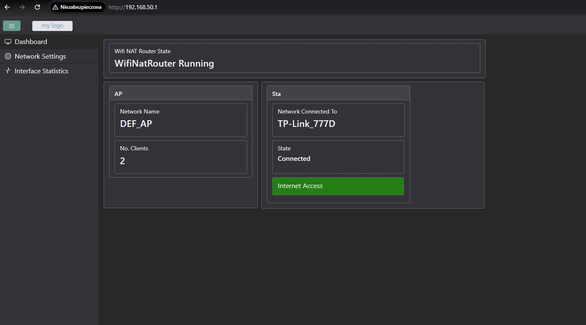
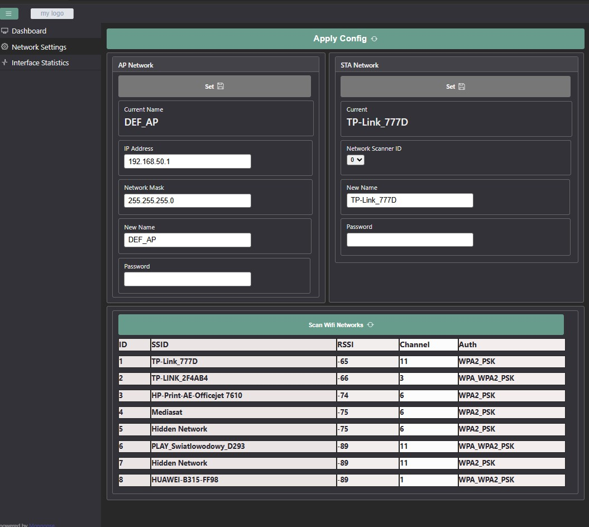

# ESP32 WiFi NAT Router

Lightweight WiFi NAT gateway built on ESP32 using ESP-IDF and lwIP.

The device operates simultaneously as:

- **WiFi Station (STA)** – connects to an upstream network  
- **WiFi Access Point (AP)** – provides a local subnet for clients  

IPv4 Network Address and Port Translation (NAPT) is handled by lwIP.  
The system exposes a small Web UI for configuration and runtime monitoring.

The goal of this project is to implement a self-contained embedded networking application with runtime configuration, persistence and explicit system state handling.

---

## System Overview

The router consists of:

- WiFi subsystem (AP + STA)
- lwIP NAT (NAPT)
- Configuration layer (runtime + persistent)
- Embedded web server (Mongoose)
- Status and diagnostics layer
- Hardware control (RGB LED, factory reset button)

Application logic is separated from ESP-IDF specifics via internal interfaces.

---

## Networking

- IPv4 NAPT (TCP / UDP / ICMP)
- Concurrent AP + STA mode
- Configurable Access Point:
  - SSID
  - password
  - IP address
  - subnet mask
  - maximum number of clients
- WiFi network scanning (for STA configuration)
- Runtime configuration updates

The router attempts automatic reconnection if the STA connection is lost.

---

## Web Interface

The device provides an embedded HTTP server based on Mongoose.

### Authentication

Two user roles are supported:

- `admin` – full configuration access  
- `user` – read-only access  

### Available views

- Router state
- Active configuration
- Network statistics
- Connected clients
- Available WiFi networks

### Configuration

- AP parameters
- STA parameters
- Router behavior settings

Configuration changes are validated and persisted before being applied.

---

## Network Statistics

The following counters are available through the Web UI:

- Total IP packets
- TCP packets
- UDP packets
- ICMP packets
- NAPT statistics:
  - active TCP entries
  - active UDP entries
  - active ICMP entries
  - forced connection evictions

Counters are updated at runtime and reset on reboot.

---

## Persistence

Configuration data is stored in NVS.

On startup:

- Default configuration is created if no valid configuration exists.
- Persisted configuration is restored automatically.

Factory reset clears NVS and restores default values.

---

## System State & Indication

The router operates as an explicit state machine (e.g. starting, connecting, running, stopping, error).

System state is indicated via RGB LED patterns:

- Starting
- Connecting
- Running
- Error
- Factory reset

This allows quick diagnostics without serial access.

---

## Failure Handling

The system handles common failure scenarios explicitly:

- STA connection failure
- Invalid configuration input
- Lost upstream connectivity
- Factory reset during operation

The focus is on predictable behavior and safe recovery.

---

## Screenshots

### Login


### Dashboard


### Network Settings


### Interface Statistics


---

## Build

```bash
idf.py set-target esp32s3
idf.py menuconfig
idf.py build
idf.py flash monitor